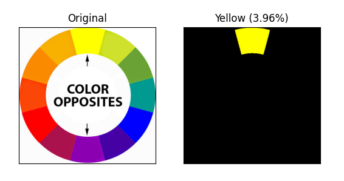

# Color discover
Python program to help colorblind people to discover a object color just by uploading a image to the program or potining the camera to it.

## Idea
This program was designed to be some type of color identifier, expecting to help colorblind people to discover the name of a color of an object. So, if you upload a image of a red object, its expected the program show exactly the red parts of the object and declare that its the red color in the object.

## Requirements
You will need [Python 3.7](https://www.python.org/) or later to run the program. Also, some libraries will be needed: [OpenCV](https://opencv.org/) and [Numpy](https://numpy.org/).

## Using
```bash
$ python3.7 color-discover-rgb.py --image path/to/image
# or
$ python3.7 color-discover-hsl.py --image path/to/image
```

Inside this repositoy is there a `color-picker.py` file, created to help the developing of the main algorithm.

To run the webcam program, you should have a video device connected, and, then, run:
```bash
$ python3.7 webcam-color-discover.py
```

## Leonardo Zanotti